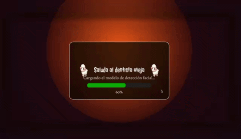

# 🐑 El Dentista Oveja

**Author / Autora:** Nathalia Carolina Padrón Bavutti  
**Title / Titulo:** The Sheep Dentist / El dentista Oveja 

---

## 🎬 Preview



---

##The implementation
I developed this project using p5.js and ml5.js.
With p5.js, I handle all the visual and interactive aspects, including rendering, interface design, animations, and the use of WEBGL to work with a facial mesh.

For real-time face tracking, I use FaceMesh from ml5.js, which allows me to detect key facial landmarks. Based on this data, I detect when the mouth is open and trigger a time-based interactive logic, generating visual feedback such as messages, a counter, and bubble animations.

I also use a triangulated face mesh with UV coordinates to apply a texture that follows the movement and orientation of the user’s face in real time.

Overall, the project combines computer vision and interactive graphics to create an educational and gamified experience.

##Acerca de la implementación
He desarrollado este proyecto utilizando p5.js y ml5.js.
Con p5.js gestiono toda la parte visual e interactiva, incluyendo el renderizado, la interfaz, las animaciones y el uso de WEBGL para trabajar con una malla facial.

Para la detección facial en tiempo real utilizo FaceMesh de ml5.js, que me permite identificar puntos clave del rostro. A partir de estos datos, detecto cuándo la boca está abierta y activo una lógica interactiva basada en tiempo, generando feedback visual como mensajes, contador y animaciones de burbujas.

Además, utilizo una malla facial triangulada con coordenadas UV para aplicar una textura que se adapta al movimiento y orientación de la cara en tiempo real.

En conjunto, combino visión por computador y gráficos interactivos para crear una experiencia educativa y gamificada.

## How to Work on This Project Locally

You can clone this repository and work on the app locally. Here’s how:

1. Clone the repo:

```bash
git clone https://github.com/nattyDCI/fml5-facemesh-project.git
cd facemesh-app
npm install
npm start

## Testing the Build
make sure the build works
1. 'npm run build'
2. Check the dist/ folder. Open the generated app for your platform (e.g., .exe on Windows, .dmg on Mac, .AppImage on Linux) and make sure the app runs correctly.

This app has been packaged using Electron to run as a standalone desktop application. To make sure the build works:

Run the build command:


## Technology Used

- **ml5.js (FaceMesh)** – for real-time facial feature detection and tracking  
- **p5.js** – for creative visualizations and interactive sketches  
- **Electron** – to package the project as a cross-platform desktop application

## 🌐 Live Page / Página en vivo

Access the live version here:  
👉 https://nattydci.github.io/ml5-facemesh-project/

---

## 🧠 About the Project / Sobre el proyecto

**EN**  
This project explores interactive experiences for early childhood using real-time face tracking to encourage hygiene habits through play.

**ES**  
Este proyecto explora experiencias interactivas para la primera infancia utilizando detección facial en tiempo real para fomentar hábitos de higiene a través del juego.

En el laboratorio **HealthySmile**, nos enfocamos en diseñar experiencias digitales que combinan aprendizaje, emoción e interacción.

---

## 🐑 Concept & Character Design / Concepto y diseño del personaje

**EN**  
The choice of a sheep as the main character is intentional:

- Sheep are perceived as **gentle, soft, and friendly**, making them ideal for young children (2–4 years old).
- Their rounded and simple features adapt well to **face filters**.
- They subtly evoke ideas of **cleanliness and care** (white wool, softness).
- The Halloween aesthetic is designed as **"safe spooky"**, avoiding fear while maintaining engagement.
- The slightly unusual design (scar, stylized wound) introduces curiosity without being threatening.

The sheep acts as a **playful mediator** between fantasy and learning.

**ES**  
La elección de una oveja como personaje principal es intencional:

- Se percibe como un animal **suave, tranquilo y amigable**, ideal para niños de 2 a 4 años.
- Sus formas simples funcionan bien en **filtros faciales**.
- Evoca ideas de **limpieza y cuidado** (lana blanca, suavidad).
- La estética de Halloween se plantea como un **“terror seguro”**, evitando generar miedo.
- Su diseño ligeramente extraño (cicatriz, herida) genera curiosidad sin rechazo.

La oveja funciona como un **puente entre la fantasía y el aprendizaje**.

---

## 🖍️ Sketches / Bocetos


> This was my initial sketch 


---

## ⚙️ How It Works / ¿Cómo funciona?

### 1. Loading Screen / Pantalla de carga  
A progress bar fills while assets are loading.  
Una barra de progreso se completa mientras se cargan los recursos.

---

### 2. Camera Activation / Activación de cámara  
The user must enable the camera to start the experience.  
El usuario debe activar la cámara para comenzar la experiencia.

---

### 3. Face Interaction / Interacción facial  

- A Halloween-themed sheep face filter appears.  
- Aparece un filtro facial de oveja con temática de Halloween.  

When the child opens their mouth:  

- Soap-like particles appear  
- Decorative elements animate (teeth and pumpkins)  
- Bubbles come out of the mouth  

Cuando el niño abre la boca:

- Aparecen partículas similares al jabón  
- Elementos decorativos se animan (dientes y calabazas)  
- Salen burbujas de la boca  

---

### 4. Feedback System / Sistema de feedback  

Every 5 seconds of correct interaction:  

- A motivational message appears  
- A visual timer fills and turns green  
- A thumbs-up icon reinforces success  

Cada 5 segundos de interacción correcta:

- Aparece un mensaje motivador  
- Un temporizador visual se llena y se vuelve verde  
- Un icono de “pulgar arriba” refuerza el logro  

> Designed mainly as **visual feedback**, since children may not read yet.  
> Diseñado principalmente como **feedback visual**, ya que los niños aún no leen.

---

### 5. Interaction Stops / Fin de interacción  

When the mouth closes:  

- Animations stop  
- Bubbles disappear  

Cuando se cierra la boca:

- Las animaciones se detienen  
- Las burbujas desaparecen  


## 📚 Resources / Recursos

### FaceMesh (ml5.js)

- https://learn.ml5js.org/#/reference/facemesh  

**EN**  
Used for real-time facial landmark detection and interaction design.

**ES**  
Utilizado para la detección de puntos faciales en tiempo real.

---

### Learning Resource (Coding Train)

- Daniel Shiffman – The Coding Train  
  https://www.youtube.com/watch?v=R5UZsIwPbJA&t=425s  

**EN**  
This tutorial was essential to understand and implement FaceMesh.

**ES**  
Este tutorial fue fundamental para implementar FaceMesh.

---

## 🛠️ Technologies Used / Tecnologías utilizadas

- p5.js 1.9.x  
- ml5.js 1.2.2  

- https://beta.p5js.org/  
- https://p5js.org/reference/  

---

## ✍️ Author Note / Nota de autor

**EN**  
This project adapts and extends existing documentation and tutorials into a child-centered interactive experience.

**ES**  
Este proyecto adapta y extiende documentación existente hacia una experiencia centrada en la infancia.